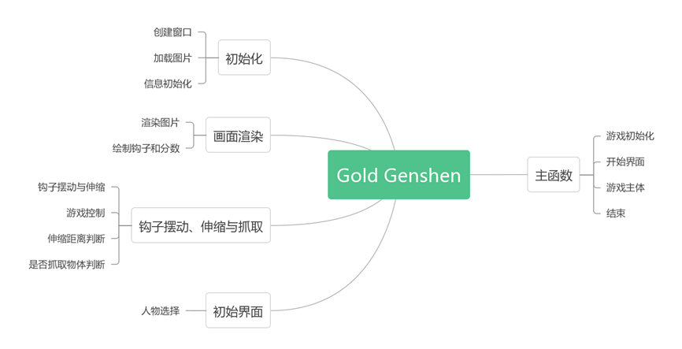
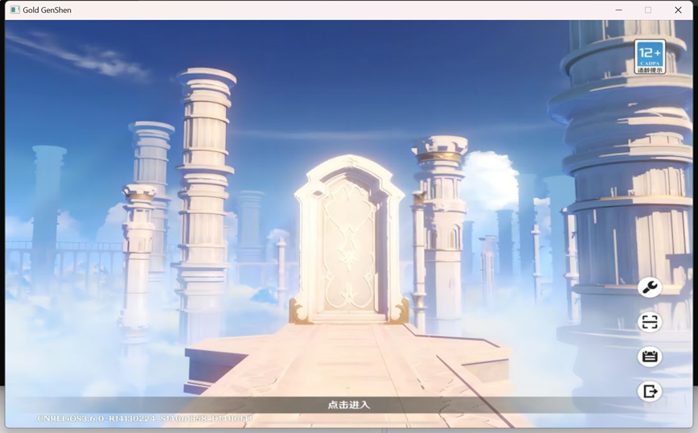
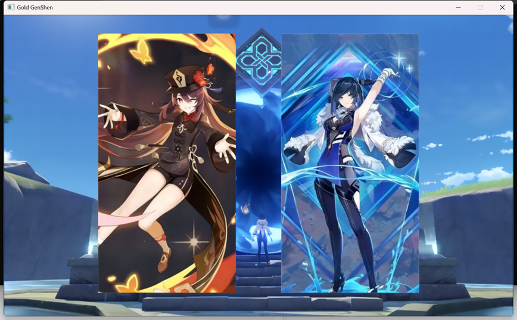
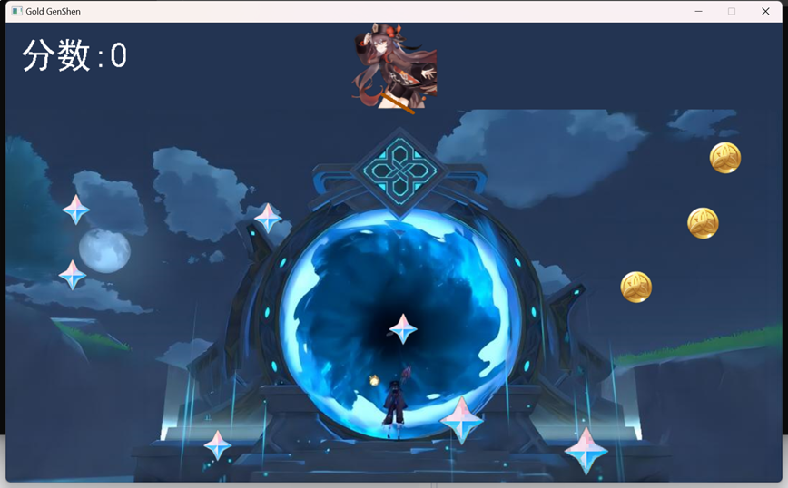

# Gold Genshen
NKU-2023-Advanced Language Programming Final Assignment-Gold Genshen 

## Supplementary Explanation
This project is written for beginners who are new to the C++language. There are references available, and beginner programming assignments can be used. Old students, please pass by.

**My Gitee address for this project:** https://gitee.com/cssay/2023c-Gold-Genshen

**Explanation video:** https://www.bilibili.com/video/BV1dM4y1h7pT?vd_source=354b82e2beab7e46fa3edf57972092a7

## Development Software
Visual Studio 2022, EasyX

## Building Ideas

## Running Display
  
  

The start interface is accessed through mouse operation to enter the game interface. During the game, click on the space and extend the hook to grab items. Items have different scores according to large rough stones, small rough stones, and mora, and the score increases with the grabbed item. When the score exceeds 450, victory is obtained.